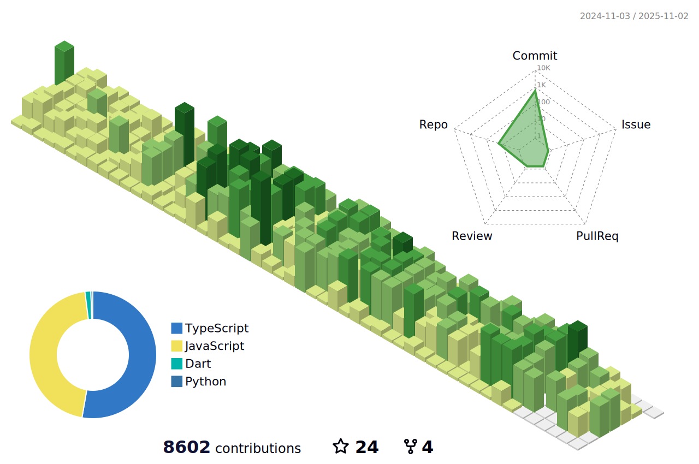

## 🙌 Hello, I'm Wukddang.

[resume](https://wukdddang.vercel.app)
[blog](https://wukdddang.github.io)

  

  Current Project
  - Lumir ERP (Now Developing)
   
  
  Current Interested In
  - AWS / Infra
  - Linux

## 🛠 Tech Stack

### Main Web Technologies

 

 

### Data Analysis Technologies

### Currently Learning

 

 

<!--CALENDAR-START-->
<!-- ## 2025/03 -->

<!-- | Sun | Mon | Tue | Wed | Thu | Fri | Sat |
| --- | --- | --- | --- | --- | --- | --- |
|     |     |     |     |     |     | 

**1**
ATS: 프로젝트 개발
 |
| 

**2**
ATS: 프로젝트 개발
 | 

**3**
ATS: 프로젝트 개발
 | 

**4**
ATS: 프로젝트 개발
 | 

**5**
ATS: 프로젝트 개발
 | 

**6**
ATS: 프로젝트 개발
 | 

**7**
ATS: 프로젝트 개발
 | 

**8**
ATS: 프로젝트 개발
 |
| 

**9**
ATS: 프로젝트 개발
 | 

**10**
ATS: 프로젝트 개발
 | 

**11**
ATS: 프로젝트 개발
 | 

**12**
ATS: 프로젝트 개발
 | 

**13**
ATS: 프로젝트 개발
 | 

**14**
ATS: 프로젝트 개발
 | 

**15**
ATS: 프로젝트 개발
 |
| 

**16**
ATS: 프로젝트 개발
 | 

**17**
ATS: 프로젝트 개발
 | 

**18**
ATS: 프로젝트 개발
 | 

**19**
ATS: 프로젝트 개발
 | 

**20**
ATS: 프로젝트 개발 + 메일 전송 프로그램 개발
 | 

**21**
ATS: 프로젝트 개발 + 메일 전송 프로그램 개발
 | 

**22**
ATS: 프로젝트 개발 + 메일 전송 프로그램 개발
 |
| 

**23**
ATS: 프로젝트 개발 + 메일 전송 프로그램 개발
 | 

**24**
ATS: 프로젝트 개발 + 메일 전송 프로그램 개발 + NestJS: 섹션 8-5~11
 | 

**25**
ATS: 프로젝트 개발 + NestJS: 섹션 8-12~15
 | 

**26**
ATS: 프로젝트 개발 + NestJS: 섹션 8-16~23
 | 

**27**
ATS: 프로젝트 개발
 | 

**28**
ATS: 프로젝트 개발
 | 

**29**
ATS: 프로젝트 개발
 |
| 

**30**
ATS: 프로젝트 개발 + NestJS: 섹션 8-24~25
 | 

**31**
ATS: 프로젝트 개발 + NestJS: 섹션 8-26~27
 |

<!--CALENDAR-END-->
